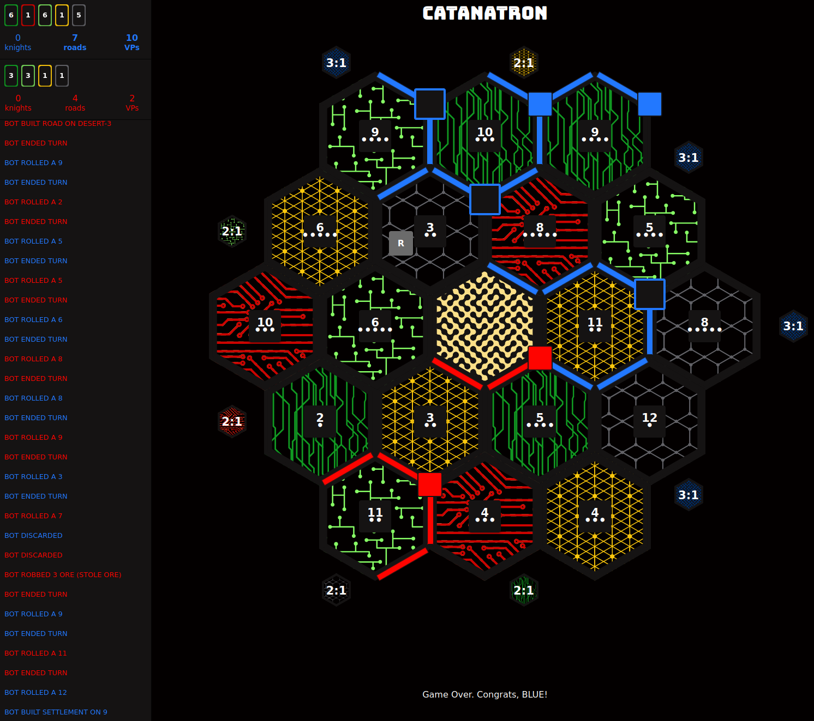

# Artificial Intelligence Approaches to the Construction Aspect of Catan

## Installation

### MacOS/Linux

Create a virtual environment and activate it:

```bash
python -m venv .venv
. .venv/bin/activate
```

Install requirements and pre-commit hooks:

```bash
pip install .
pip install -e 'git+https://github.com/bcollazo/catanatron#egg=catanatron_server&subdirectory=catanatron_server'
pre-commit install
```

### Windows

```Powershell
python -m venv .venv
. .\venv\Scripts\Activate.ps1
```

If this above command produces an error related to execution policy

```Powershell
Set-ExecutionPolicy -ExecutionPolicy RemoteSigned -Scope CurrentUser
```

After setting the policy, retry activation:

```Powershell
. .\venv\Scripts\Activate.ps1
```

## Playing Games

To simulate a game between an AI agent as blue and a random agent as red, run the `play.py` script. It takes two optional arguments. The first is the model you would like to use:

- `mcts` - The Monte-Carlo Tree Search agent
- `td` - The Temporal Difference Learning agent
- `ga` - The Genetic Algorithm agent
- `dqn` - The Deep Q-Network agent

If no model is selected/it is not one of the four above (case insensitive) then a random agent will be played as blue. The second argument is the number of games to play. By default, this will be 1.

Once the games have been played, a scoreboard will be output. Due to the 1,000 turn limit imposed by the Catanatron environment, draws are to be expected as a result of the inability for agents to trade, causing a poor starting position to make the game nearly unwinnable.

## Visualizing Games



If you'd like to visualize the final state of the last game played, you must download the full Catanatron repository to use the experimental visualization server:

```bash
git clone https://github.com/bcollazo/catanatron.git
```

To launch the visualization server, within the newly cloned repository run:

```bash
docker compose up
```

Note that you must have Docker/Docker Compose installed. See [the Docker docs](https://docs.docker.com/compose/install/) for more instructions. The container launched with the above command must remain running so long as you want to visualize Catan games. Once your games have been played, the final game state of the final game should be opened in your default browser automatically.
